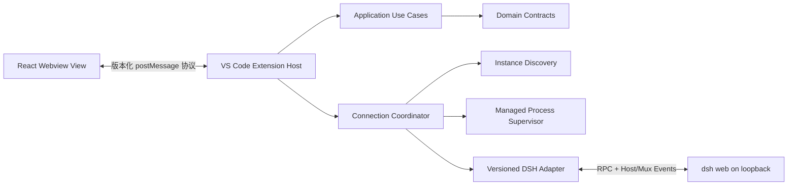

# DeepSeek Harness for VS Code

一个面向 DeepSeek Harness（DSH）的极简 VS Code 客户端。项目目标是在 VS Code 原生侧栏体验中覆盖 DSH Web 的主要能力，并可靠复用已经启动的本地 DSH，避免重复进程。

> 当前状态：**仅完成工程初始化和全量实现骨架，所有产品能力仍是 TODO。** 骨架可以构建并用于逐功能开发，但不可作为可用插件发布。

## 必须满足的产品原则

- 默认提供 Activity Bar 中的 DSH Webview View；用户可拖到 VS Code Secondary Side Bar，布局由 VS Code 持久化。
- 每次自动启动前先发现并验证已运行的兼容 DSH；外部进程永不由扩展停止。
- 找不到 DSH 时，在视图底部提供安装、复制命令、选择可执行文件、重试和文档入口；安装必须由用户明确触发。
- 端口、连接模式、Agent Preset、Tools Mode、权限、Plan Mode、Provider、Model 和 Reasoning 均可配置。
- DSH Web Host API 是主通道；所有上游协议变化都隔离在版本化 Adapter 中。
- Extension Host 是进程、网络、文件系统和凭据的唯一信任边界；Webview 不直接访问 DSH。

## 架构概览



详细依赖规则和目录职责见 [docs/architecture.md](docs/architecture.md)。完整功能清单见 [docs/capability-matrix.md](docs/capability-matrix.md)。

## 开始开发

先安装 Node.js `>=22.19.0 <27` 和 pnpm `11.19.0`：

```powershell
corepack enable
pnpm install --frozen-lockfile
pnpm check
pnpm build
```

在 VS Code 中按 `F5` 启动 Extension Development Host。完整环境、调试、测试和真实 DSH 验证步骤见 [docs/development.md](docs/development.md)。

## 接手实现的阅读顺序

1. [AGENTS.md](AGENTS.md)：不可违反的实现规则。
2. [docs/implementation-order.md](docs/implementation-order.md)：按垂直切片实施的顺序和退出条件。
3. [docs/capability-matrix.md](docs/capability-matrix.md)：不漏功能的唯一清单。
4. [docs/dsh-contract.md](docs/dsh-contract.md)：上游版本、RPC、事件和工具契约来源。
5. [docs/protocol.md](docs/protocol.md)、[docs/security.md](docs/security.md)、[docs/testing.md](docs/testing.md)。
6. 搜索 `TODO` 和 `unimplemented(`；每个占位都内嵌了该函数的实现要求。

## 常用命令

| 命令                | 用途                                |
| ------------------- | ----------------------------------- |
| `pnpm dev`          | 同时监听 Webview 和 Extension 构建  |
| `pnpm build`        | 先构建 Webview，再打包 Extension    |
| `pnpm typecheck`    | 对所有 workspace 包执行严格类型检查 |
| `pnpm lint`         | ESLint 类型感知检查                 |
| `pnpm test`         | Vitest 单元、契约和集成测试         |
| `pnpm check`        | 格式、Lint、类型、测试总门禁        |
| `pnpm package:vsix` | 构建并输出 `artifacts/*.vsix`       |

## 上游基线

- DSH npm 包：`@deepseek-ai/dsh@0.1.0-rc.6`
- DSH API 适配依赖：`@deepseek-ai/dsh-host-apiproxy@0.1.0-rc.6`
- 契约审查基线提交：`47f943859bef60e4160492346772ded9b24f765a`

升级 DSH 前必须新增版本 Adapter 或完成显式迁移，禁止直接让 rc.6 代码“兼容猜测”未知版本。
