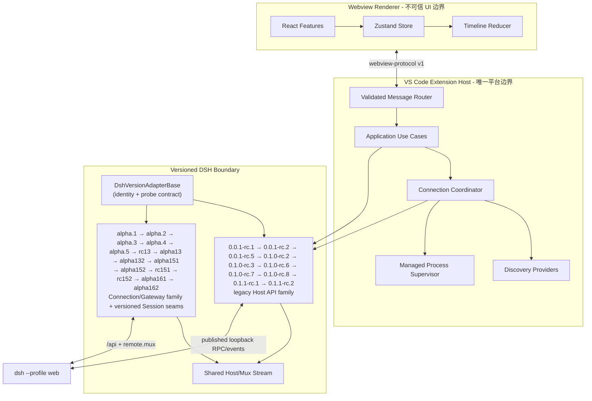
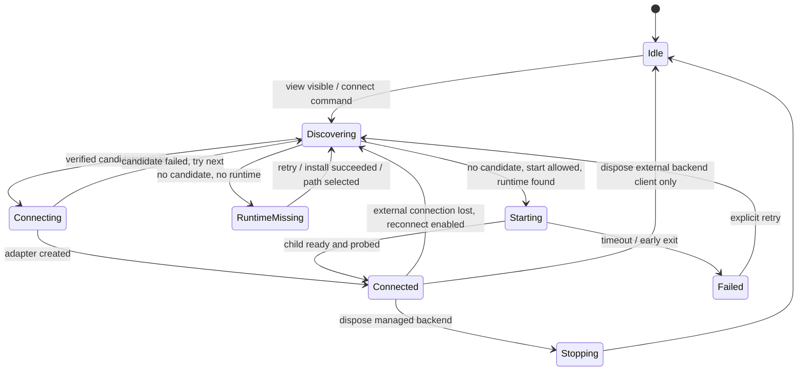

# 架构与目录职责

## 运行时结构



## 包依赖

| 包                          | 职责                                                                                                                                                                        | 可以依赖                                | 禁止依赖                      |
| --------------------------- | --------------------------------------------------------------------------------------------------------------------------------------------------------------------------- | --------------------------------------- | ----------------------------- |
| `packages/domain`           | 稳定业务类型、错误、仓储接口                                                                                                                                                | 无平台依赖                              | VS Code、React、HTTP、process |
| `packages/application`      | 用例、连接协调、端口接口                                                                                                                                                    | Domain                                  | DSH wire type、VS Code UI     |
| `packages/dsh-adapter`      | `0.0.1-rc.1/.2/.5`、`0.1.0-rc.2/.3`、rc.6–0.1.2-rc.1、alpha.1–alpha.5、0.1.3-alpha.1/.2、`0.1.5-alpha.1/.2/rc.1/rc.2` 与 `0.1.6-alpha.1/.2` 的 RPC/Event 映射、仓储、流恢复 | Domain、Application ports、固定上游包   | VS Code、React                |
| `packages/webview-protocol` | Host/Webview 版本化消息 Schema                                                                                                                                              | Zod                                     | 传输实现、Secret              |
| `packages/timeline`         | 事件归并、回放、可见窗口                                                                                                                                                    | Domain                                  | React、VS Code、HTTP          |
| `packages/ui`               | 无业务副作用的可复用 UI                                                                                                                                                     | React、Domain view DTO                  | DSH、VS Code API              |
| `apps/extension`            | Composition Root、进程/文件/网络/凭据、命令                                                                                                                                 | Application、Adapter、Protocol、VS Code | React                         |
| `apps/webview`              | 极简 UI、局部状态、虚拟列表                                                                                                                                                 | UI、Timeline、Protocol                  | Node、VS Code 模块、直接网络  |

## 完整目录

```text
apps/
  extension/
    src/
      backend/
        discovery/        # 候选来源；不负责健康验证
        diagnostics.ts    # allowlist 脱敏输出
        process-supervisor.ts
        runtime-locator.ts
      commands/           # VS Code 命令注册和错误呈现
      config/             # dsh.* 设置读取/验证
      view/               # WebviewViewProvider、CSP、路由
      vscode/             # 凭据、安装、context keys、右栏引导
      activate.ts
      composition-root.ts
      extension.ts
  webview/
    src/
      app/                 # Store 和协议客户端
      features/            # 按能力分隔 UI，不共享副作用
      styles/
packages/
  application/            # Use cases + ports
  domain/                 # 业务契约
  dsh-adapter/
    src/adapter-base.ts   # 版本 identity/probe 结构基类
    src/versions/legacy/  # 0.0.1-rc.1/.2 旧 Host frame/command/repository 契约
    src/versions/legacy01/ # 0.0.1-rc.1 精确版本入口
    src/versions/legacy02/ # 0.0.1-rc.2 精确版本入口
    src/versions/legacy05/ # 0.0.1-rc.5 精确版本入口
    src/versions/rc02/    # 0.1.0-rc.2 精确版本入口
    src/versions/rc03/    # 0.1.0-rc.3 精确版本入口
    src/versions/rc6/     # rc.6 兼容基线与 legacy mapper
    src/versions/rc7/     # rc.7 版本身份与契约入口
    src/versions/rc8/     # rc.8 版本身份、增量事件与契约入口
    src/versions/rc11/    # 0.1.1-rc.1 工作区空白会话复用入口
    src/versions/rc12/    # 0.1.1-rc.2 去除 rc.1 空白复用字段的会话入口
    src/versions/rc13/    # 0.1.2-rc.1 保持 alpha.5 v0 wire 的已发布入口
    src/versions/alpha/   # alpha 家族共用 /api + remote.mux 传输与组装
    src/versions/alpha2/  # 0.1.2-alpha.2 独立版本入口与错误词汇
    src/versions/alpha3/  # 0.1.2-alpha.3 独立版本身份入口
    src/versions/alpha4/  # 0.1.2-alpha.4 独立版本身份入口
    src/versions/alpha5/  # 0.1.2-alpha.5 独立版本身份入口
    src/versions/alpha13/ # 0.1.3-alpha.1 Session v2 独立版本缝
    src/versions/alpha132/ # 0.1.3-alpha.2 Session v2 + subagent delivery 独立版本缝
    src/versions/alpha151/ # 0.1.5-alpha.1 Session v3 严格事件缝
    src/versions/alpha152/ # 0.1.5-alpha.2 Session v3 + deliverables/catalog 精确入口
    src/versions/rc151/    # 0.1.5-rc.1 Session v3 + deliverables/catalog 精确入口
    src/versions/rc152/    # 0.1.5-rc.2 Session v3 + rc.2 feedback/deliverables 精确入口
    src/versions/alpha161/ # 0.1.6-alpha.1 Session v3 + projection-event 安全降级入口
    src/versions/alpha162/ # 0.1.6-alpha.2 Session v3 + Inbox control projection 精确入口
    src/repositories/     # 每个能力域一个仓储
  timeline/
  ui/
  webview-protocol/
  test-support/
tests/
  live-dsh/
  vscode-e2e/
docs/
  adr/
```

## 连接状态机



`auto` 模式必须完整走完 Discovering 才能 Starting；`attach-only` 没有 Starting 边；`new-isolated` 明确跳过外部候选但仍禁止创建两个受管子进程。
`custom` 模式只把用户配置的、经过 Host 校验的 loopback endpoint 作为候选；健康检查失败直接进入 Failed，不执行发现、运行时定位或启动。

## 进程所有权不变量

| 来源                              | ownership  | 扩展关闭时                   | 连接断开时                   |
| --------------------------------- | ---------- | ---------------------------- | ---------------------------- |
| 设置/已知端口/进程发现/companion  | `external` | 仅关客户端和流               | 尝试重连或提示，绝不停止进程 |
| 当前扩展 `spawn` 并持有子进程句柄 | `managed`  | 优雅停止，超时后只终止该句柄 | 按策略重连或停止该子进程     |

PID 不能单独证明所有权。只有当前进程内创建并保存的 `ManagedProcessHandle` 才允许停止。

## 扩展点

- 新 DSH 版本：先确认属于 legacy rc 或 alpha Connection/Gateway wire family，再接在对应线性链末尾
  新增 `versions/<version>` 入口，只声明独立 identity 和已核对的增量。只有真实 wire 变化才新增
  family base 或 mapper；不得跨 family 继承，也不得为了复用实现跳过中间已发布版本。
  `DshVersionAdapterBase` 统一 identity/probe 结构，版本入口不再重复实现公共元数据。
- 新发现方法：实现 `DiscoveryProvider`，输出候选；协议验证仍由 Probe 完成。
- 新工具：向 `ToolRendererRegistry` 注册；未知工具始终退回通用卡片。
- 新功能 UI：新增 `features/<capability>`；通过协议和用例调用，不直接跨层。
