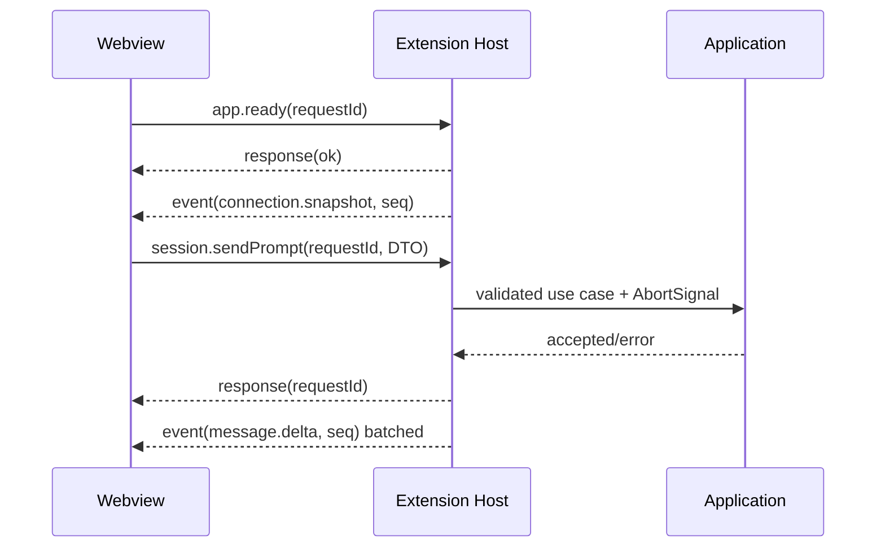

# Extension Host 与 Webview 协议

协议实现位于 `packages/webview-protocol`，当前版本为 `1`。所有消息必须先用 Zod 校验，再产生副作用。

## 不变量

- Webview 请求有唯一 `requestId`；Host 对每个请求最多返回一个终态响应。
- 长期状态变化使用递增 `sequence` 的 event；UI 忽略重复/旧序号。
- Webview 不获得 DSH endpoint、pid、命令行、绝对工作区路径、Secret 或原始诊断 body。工作区列表只发送
  opaque workspace/session id 和显示字段；Extension Host 在发送前完成工作区成员匹配并移除 workspace `path`、session
  `cwd` 以及工具 terminal 的绝对工作目录。文件/变更卡片中的路径仍是产品需要的相对文件标识，不用于工作区归属判断。
- Host 不信任 Webview：所有 enum、id、port、path、数组长度和字符串长度在 Host 再验证。
- 协议只传可序列化 DTO，不传 Error、Map、Set、AbortSignal、VS Code 对象或上游 `0.0.1-rc.1/.2/.5`、`0.1.0-rc.2/.3`、rc.6–0.1.2-rc.1、`0.1.2-alpha.1`–`.5`、`0.1.3-alpha.1/.2`、`0.1.5-alpha.1/.2/rc.1` 类。

## 生命周期

## 当前请求覆盖

Schema 已为以下域定义严格 discriminated union：应用/连接/Runtime、Workspace、Session CRUD、Prompt、Queue/Steer、附件、`@` 文件/会话引用、消息反馈、模型/Provider/Secret、审批/问题、Settings、Goal、Job、Subagent、Workflow、Skill、动态命令、Plugin、Export、诊断和右栏引导。Extension Host 对请求再次校验，并通过 Application ports 路由；精确请求名与字段以 `packages/webview-protocol/src/schemas.ts` 为唯一代码来源。

当前 Webview 已使用的关键通路包括 `app.ready`、`connection.configure/retry`、`runtime.update.check/install`、`session.list/open/create/sendPrompt/cancel`、队列操作、`providers.list`、`models.list`、`preset.list/select`、附件选择、已打开文件列表/添加、`reference.list`、`feedback.*` 和审批/问题响应。`connection.configure` 只接收模式与用户输入的端点，Host 校验并持久化 loopback URL；端点本身不会回传 Webview。`runtime.update.*` 只传递脱敏版本标签；npm 元数据查询、精确版本校验和全局安装均由 Extension Host 完成，Webview 不直接联网或执行命令。更新期间 Host 通过 `runtime.update.progress` 事件发送 `checking`、`downloading`、`verifying`、`completed` 或 `failed` 阶段；npm 不提供跨版本稳定的字节百分比，因此 Webview 显示有阶段文字的非确定进度条，不伪造下载百分比。0.1.0-rc.8/0.1.1-rc.1/0.1.1-rc.2 的 `imageLimits` 会话投影用于附件数量/大小的 Host 对齐预检；支持图片输入的动态斜杠命令通过 Host 转换为上游 `EncodedImageAttachment`，命令不支持图片或执行失败时保留草稿和附件句柄；工具 mutation 的 `locations` 会映射为产出文件 chips 及回复正文中的安全文件提及。中断回复、结构化 `turn/end` 失败和 Agent Teams 事件以安全 Domain DTO 展示。`0.0.1-rc.1/.2` 使用各自旧 Host API 入口：command 目录/执行走 unary `command.*`，0.0.1-rc.1 的旧 Host invalidation 和 0.0.1-rc.2 的 `host/remote-event` 在 Host 内归一化，0.0.1-rc.2 的任务快照是 `session/tasks`；0.0.1-rc.1 不发送 `clientTimeZone` 且不提供 ZIP/工作区排序，0.0.1-rc.2 只在请求与事件中使用上游已声明的时区字段。0.0.1-rc.1/rc.2 之后的历史 rc 入口分别复用已核实的 rc.6 Host wire；`0.1.2-rc.1` 保持 alpha.5 的 v0 Session packed history wire；最新 `0.1.3-alpha.1` 只在其精确 Adapter 中启用 `isSeeded`、event-only history 和 assistant stream v2；旧版本缺少这些字段时沿用基础创建流程。旧版本没有可选反馈、引用或 locations 契约时，Adapter 返回空结果或安全降级。rc.6–0.1.2-rc.1 不包含的动态命令、Plugin、Workflow 和部分 Job 控制由 Adapter 明确返回不可用，不会退化成任意模型 Prompt。

`0.1.2-alpha.1`、`0.1.2-alpha.2`、`0.1.2-alpha.3`、`0.1.2-alpha.4`、`0.1.2-alpha.5`、`0.1.2-rc.1`、`0.1.3-alpha.1/.2` 与 `0.1.5-alpha.1/.2/rc.1` 由 Extension Host 内的版本化 alpha/rc 适配处理：新 `/api/<namespace>/<method>` Connection RPC、Cookie 握手和 `/api/remote.mux` 流均在 Host 处理，再投影为同一组 Domain/Application DTO；rc.1 沿用 alpha.5 v0，`0.1.3-alpha.1/.2` 使用 Session v2，`0.1.5-alpha.1/.2/rc.1` 使用严格 Session v3，且只有 `.2` 的精确 Adapter 向 `subagent.prompt` 发送必填 `delivery: queue|steer`。v3 的 `system/message` 仅在 Host 保留为无提示内容的序号水印，PTC 事件映射到既有工具 DTO；alpha.2/alpha.3/alpha.4/alpha.5 的命名空间 Remote 错误在版本边界归一化，`ignorable` 事件和可选 agent-preset 插件组合只以严格 DTO 向上投影。`alpha152`/`rc151` 的 `deliverables/presented` 映射为有界的交付文件 DTO，`subagent/catalog` 映射为父会话目录事实；Timeline 只显示相对文件标识，打开/显示文件继续经 Extension Host 既有路径校验委托。Webview 不接收 launch token、Cookie、endpoint、系统提示词或原始上游错误。该适配不改变 Webview 协议版本，安装器当前默认精确支持集合中的最新 `0.1.5-rc.1`。

`0.0.1-rc.1/.2`、`0.0.1-rc.5`、`0.1.0-rc.2/.3` 由 Extension Host 内的 legacy/rc 版本化 Adapter 处理；前两者的差异只通过 legacy frame parser、command repository 和显式能力降级承载，后者不通过猜测而复用已核对的 rc.6 wire。Webview 只看到稳定 Domain DTO。

实现各能力时必须扩展 discriminated union，而不是发送通用 `{ action: string, payload: any }`。新增消息同时更新：Schema、类型、Router 测试、ProtocolClient 测试和本文件。

## 错误响应

错误只包含稳定 `code`、面向用户的脱敏 `message` 和 `retryable`。堆栈、HTTP body、prompt、tool input/output、Secret、endpoint 不进入协议。

## 流量控制

- Message delta 在 Host 或 Store 以 animation frame/16–50ms 合批；终态事件立即发送。
- 一个 backend 只有一个上游事件流，Host 多播到一个 Webview store。
- 大历史通过分页/窗口传输，不在一次 postMessage 中传整库。
- Webview 隐藏时暂停昂贵的渲染与非关键刷新，但审批/提问/连接事件仍维护状态。
