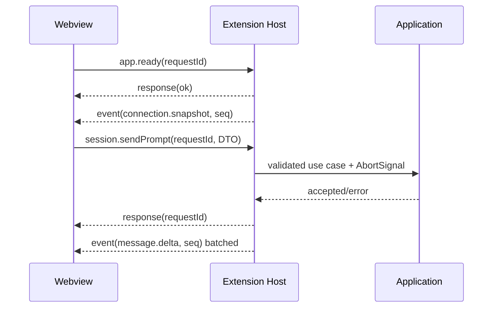

# Extension Host 与 Webview 协议

协议实现位于 `packages/webview-protocol`，当前版本为 `1`。所有消息必须先用 Zod 校验，再产生副作用。

## 不变量

- Webview 请求有唯一 `requestId`；Host 对每个请求最多返回一个终态响应。
- 长期状态变化使用递增 `sequence` 的 event；UI 忽略重复/旧序号。
- Webview 不获得 DSH endpoint、pid、命令行、绝对工作区路径、Secret 或原始诊断 body。
- Host 不信任 Webview：所有 enum、id、port、path、数组长度和字符串长度在 Host 再验证。
- 协议只传可序列化 DTO，不传 Error、Map、Set、AbortSignal、VS Code 对象或上游 rc.6 类。

## 生命周期

## 当前请求覆盖

Schema 已为以下域定义严格 discriminated union：应用/连接/Runtime、Workspace、Session CRUD、Prompt、Queue/Steer、附件、模型/Provider/Secret、审批/问题、Settings、Goal、Job、Subagent、Workflow、Skill、动态命令、Plugin、Export、诊断和右栏引导。Extension Host 对请求再次校验，并通过 Application ports 路由；精确请求名与字段以 `packages/webview-protocol/src/schemas.ts` 为唯一代码来源。

当前 Webview 已使用的关键通路包括 `app.ready`、`session.list/open/create/sendPrompt/cancel`、队列操作、`providers.list`、`models.list`、`preset.list/select`、附件选择、已打开文件列表/添加和审批/问题响应。rc.6 不包含的动态命令、Plugin、Workflow 和部分 Job 控制由 Adapter 明确返回不可用，不会退化成任意模型 Prompt。

实现各能力时必须扩展 discriminated union，而不是发送通用 `{ action: string, payload: any }`。新增消息同时更新：Schema、类型、Router 测试、ProtocolClient 测试和本文件。

## 错误响应

错误只包含稳定 `code`、面向用户的脱敏 `message` 和 `retryable`。堆栈、HTTP body、prompt、tool input/output、Secret、endpoint 不进入协议。

## 流量控制

- Message delta 在 Host 或 Store 以 animation frame/16–50ms 合批；终态事件立即发送。
- 一个 backend 只有一个上游事件流，Host 多播到一个 Webview store。
- 大历史通过分页/窗口传输，不在一次 postMessage 中传整库。
- Webview 隐藏时暂停昂贵的渲染与非关键刷新，但审批/提问/连接事件仍维护状态。
