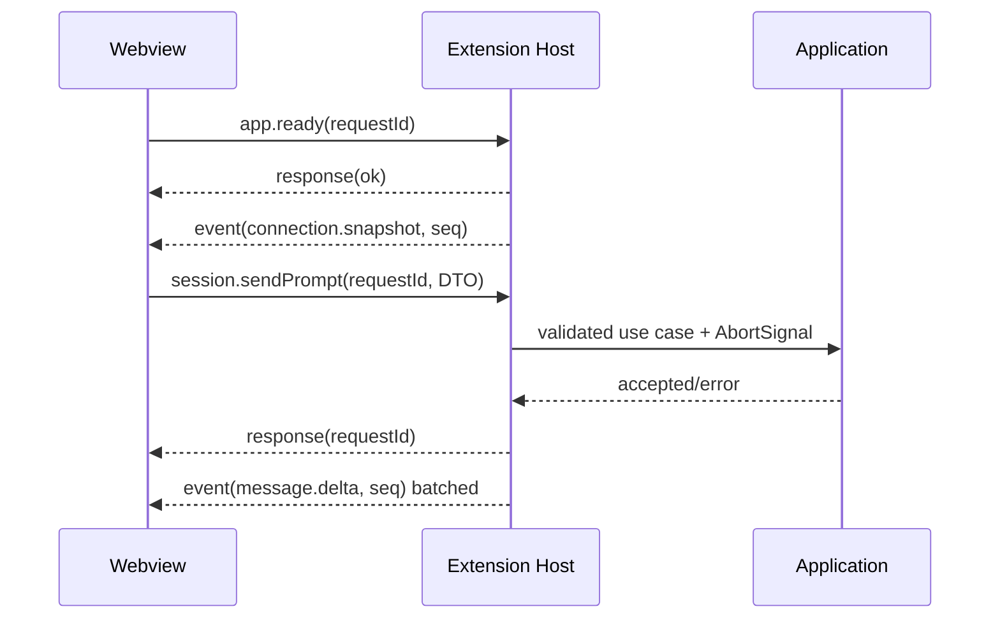

# Extension Host 与 Webview 协议

协议实现位于 `packages/webview-protocol`，当前版本为 `1`。所有消息必须先用 Zod 校验，再产生副作用。

## 不变量

- Webview 请求有唯一 `requestId`；Host 对每个请求最多返回一个终态响应。
- 长期状态变化使用递增 `sequence` 的 event；UI 忽略重复/旧序号。
- Webview 不获得 DSH endpoint、pid、命令行、绝对工作区路径、Secret 或原始诊断 body。工作区列表只发送
  opaque workspace/session id 和显示字段；Extension Host 在发送前完成工作区成员匹配并移除 workspace `path`、session
  `cwd` 以及工具 terminal 的绝对工作目录。文件/变更卡片中的路径仍是产品需要的相对文件标识，不用于工作区归属判断。
- 会话投影的 `workspaceFolderId` 是 Extension Host 解析出的 VS Code 文件夹 id，与 DSH workspace registry id 属于不同命名
  空间；路径作用域的 feature 请求只接受前者，Host 从会话 `cwd` 解析它，Webview 不自行推断归属。该字段缺失表示当前没
  有打开 VS Code 文件夹（例如只用扩展临时工作区），此时文件/变更/检查点/提示词模板等读取不发起，也不报告失败。
- Host 不信任 Webview：所有 enum、id、port、path、数组长度和字符串长度在 Host 再验证。
- 协议只传可序列化 DTO，不传 Error、Map、Set、AbortSignal、VS Code 对象或上游 DSH 类型。
- `job.follow.updated` 与 `job.follow.failed` 使用闭合 Host event schema；Job/frame/chunk 只透出 allowlisted 字段，offset 必须是安全整数，chunk 的 UTF-8 字节末端不得超过 `next`。`at`/`next` 是 UTF-8 byte offsets：DSH 可在打开后首次返回带数据的帧中重放一个跨越恢复游标的完整 chunk，Webview 按字节裁掉已显示前缀；后续真实缺口和非码点边界的恢复均 fail closed。其他 backend events 仍走通用 event schema。

## 生命周期

## 当前请求覆盖

`0.1.6-alpha.1` 使用独立 `alpha161` Adapter：其基础 Connection/Gateway 与 Session v3 wire 复用已核对的 rc.2 边界；`image/offload` 事件仅以脱敏 opaque unknown 进入统一时间线。`0.1.6-alpha.2` 使用独立 `alpha162` Adapter：保留 Session v3，但 `session/control` 的 Inbox projection 在 Host 侧归约为既有 Queue/Steer DTO，alpha.1 的 `queues` 基线不跨版本复用；`session/writer-held` 映射为可重试忙碌错误。`0.1.7-alpha.1` 使用独立 `alpha171` Adapter：Session V4 的 first-class tool message 先严格校验再投影为既有时间线工具结果，projection-only `session/control` 不再产生 Jobs，Workspace follow 要求 pinned 集合，Job 列表经独立 rows stream 读取；registry-only preset roster 保留 `modeSelectionEnabled`，不宣称旧版用户 preset 管理接口，plugin inventory 按新组合形状映射。`0.1.7-alpha.2` 与 `0.1.7-rc.1` 使用独立 exact adapter，继续使用 V4 与 Job Controller，并只在这两个版本的普通会话/子代理 transcript 分页中发送 turnWindow；补洞等严格读取仍按 durable sequence 分页。Alpha.2 的 `projectContent()` 输出作为结构化工具内容块映射，不解析渲染文本。新增 alpha surface 不改变 Webview 协议。两个 0.1.6 版本与 alpha171 系新增的终端、权限预设、Skill 路径和 Job 输出控制等未实现上游 API 不因此变成可用能力。

Schema 已为以下域定义严格 discriminated union：应用/连接/Runtime、Workspace、Session CRUD、Prompt、Queue/Steer、附件、`@` 文件/会话引用、消息反馈、模型/Provider/Secret、审批/问题、Settings、Goal、Job、Subagent、Workflow、Skill、动态命令、Plugin、Export、诊断和右栏引导。Extension Host 对请求再次校验，并通过 Application ports 路由；精确请求名与字段以 `packages/webview-protocol/src/schemas.ts` 为唯一代码来源。

RC2 插件安装使用独立的 `installRequestId` 关联 DSH 安装生命周期，和单次 Webview feature request 的 `requestId` 分开。安装回包丢失或取消返回 `too-late` 时，恢复始终使用同一安装 ID：同一 Host 已完成的安装结果在有界缓存期内会投影为等待结果；缓存未命中时调用 `pluginManager/waitForInstall`。结果仍未知或读取失败时显示未知并刷新目录，不会据此再次安装。恢复等待期间仍可向 Host 发送同 ID 取消。长安装请求有单独的 10 分钟响应预算；Host 对相同安装、取消和等待请求去重，并限制完成请求缓存。

RC2 账号详情响应中的 `accountScopeRevision` 是 Host 生成的非负安全整数，只表达 Host 已观察到的账号作用域变化或清除；它只在单个 Host 生命周期内单调，账号 ID 仍只留在 Extension Host。Webview 按该 revision 清除上一账号的奖励提示、确认重试和待处理 UI 状态；连接身份变化时 Store 还会清空整份账号快照，避免 Host 重连后 revision 重用造成旧卡片复现。

当前 Webview 已使用的关键通路包括 `app.ready`、`connection.configure/retry`、`runtime.update.check/install`、`session.list/open/create/sendPrompt/cancel`、队列操作、`providers.list`、`models.list`、`preset.list/read/copy/remove/openDocument`（会话实际使用的预设仍由 `session.configure` 写入）、附件选择、已打开文件列表/添加、`reference.list`、`feedback.*` 和审批/问题响应。`connection.configure` 只接收模式与用户输入的端点，Host 校验并持久化 loopback URL；端点本身不会回传 Webview。`runtime.update.*` 只传递脱敏版本标签；npm 元数据查询、精确版本校验和全局安装均由 Extension Host 完成，Webview 不直接联网或执行命令。更新期间 Host 通过 `runtime.update.progress` 事件发送 `checking`、`downloading`、`verifying`、`completed` 或 `failed` 阶段；npm 不提供跨版本稳定的字节百分比，因此 Webview 显示有阶段文字的非确定进度条，不伪造下载百分比。0.1.0-rc.8/0.1.1-rc.1/0.1.1-rc.2 的 `imageLimits` 会话投影用于附件数量/大小的 Host 对齐预检；支持图片输入的动态斜杠命令通过 Host 转换为上游 `EncodedImageAttachment`，命令不支持图片或执行失败时保留草稿和附件句柄；工具 mutation 的 `locations` 会映射为产出文件 chips 及回复正文中的安全文件提及。中断回复、结构化 `turn/end` 失败和 Agent Teams 事件以安全 Domain DTO 展示。`0.0.1-rc.1/.2` 使用各自旧 Host API 入口：command 目录/执行走 unary `command.*`，0.0.1-rc.1 的旧 Host invalidation 和 0.0.1-rc.2 的 `host/remote-event` 在 Host 内归一化，0.0.1-rc.2 的任务快照是 `session/tasks`；0.0.1-rc.1 不发送 `clientTimeZone` 且不提供 ZIP/工作区排序，0.0.1-rc.2 只在请求与事件中使用上游已声明的时区字段。0.0.1-rc.1/rc.2 之后的历史 rc 入口分别复用已核实的 rc.6 Host wire；`0.1.2-rc.1` 保持 alpha.5 的 v0 Session packed history wire；最新 `0.1.3-alpha.1` 只在其精确 Adapter 中启用 `isSeeded`、event-only history 和 assistant stream v2；旧版本缺少这些字段时沿用基础创建流程。旧版本没有可选反馈、引用或 locations 契约时，Adapter 返回空结果或安全降级。rc.6–0.1.2-rc.1 不包含的动态命令、Plugin、Workflow 和部分 Job 控制由 Adapter 明确返回不可用，不会退化成任意模型 Prompt。

`0.1.2-alpha.1` 至 `alpha.5`、`0.1.2-rc.1`、`0.1.3-alpha.1/.2`、`0.1.5-alpha.1/.2/rc.1/rc.2/rc.3`、`0.1.6-alpha.1/.2`、`0.1.7-alpha.1/.2` 与 `0.1.7-rc.1/.2` 由 Extension Host 内的版本化 alpha/rc 适配处理：新 `/api/<namespace>/<method>` Connection RPC、Cookie 握手和 `/api/remote.mux` 流均在 Host 处理，再投影为同一组 Domain/Application DTO；rc.1/rc.2 沿用 alpha.5 v0，`0.1.3-alpha.1/.2` 使用 Session v2，`0.1.5-alpha.1/.2/rc.1/rc.2/rc.3` 与 `0.1.6-alpha.1/.2` 使用严格 Session v3，`0.1.7-alpha.1/.2/rc.1/.2` 使用严格 Session V4，且只有 `0.1.3-alpha.2` 的精确 Adapter 向 `subagent.prompt` 发送必填 `delivery: queue|steer`。RC2 新增的 Plugin Manager wait Remote 只用于追踪相同 install request；wait 结果未知时不重试安装。v3/V4 的 `system/message` 仅在 Host 保留为无提示内容的序号水印，PTC 事件映射到既有工具 DTO；alpha.2/alpha.3/alpha.4/alpha.5/alpha171 系的命名空间 Remote 错误在版本边界归一化，`ignorable` 事件和可选 agent-preset 插件组合只以严格 DTO 向上投影。`alpha152`/`rc151`/`rc152`/`rc153` 的 `deliverables/presented` 映射为有界的交付文件 DTO，`subagent/catalog` 映射为父会话目录事实；rc.2 的消息反馈按上游分类集合进入统一提交对话框，Timeline 只显示相对文件标识，打开/显示文件继续经 Extension Host 既有路径校验委托。Webview 不接收 launch token、Cookie、endpoint、系统提示词或原始上游错误。该适配不改变 Webview 协议版本；安装器精确安装 `0.1.5-rc.3`，不解析 npm dist-tag。

`0.0.1-rc.1/.2`、`0.0.1-rc.5`、`0.1.0-rc.2/.3` 由 Extension Host 内的 legacy/rc 版本化 Adapter 处理；前两者的差异只通过 legacy frame parser、command repository 和显式能力降级承载，后者不通过猜测而复用已核对的 rc.6 wire。Webview 只看到稳定 Domain DTO。

实现各能力时必须扩展 discriminated union，而不是发送通用 `{ action: string, payload: any }`。新增消息同时更新：Schema、类型、Router 测试、ProtocolClient 测试和本文件。

## 错误响应

错误只包含稳定 `code`、面向用户的脱敏 `message` 和 `retryable`。堆栈、HTTP body、prompt、tool input/output、Secret、endpoint 不进入协议。

## 流量控制

- Message delta 在 Host 或 Store 以 animation frame/16–50ms 合批；终态事件立即发送。
- 一个 backend 只有一个上游事件流，Host 多播到一个 Webview store。
- 大历史通过分页/窗口传输，不在一次 postMessage 中传整库。
- Webview 隐藏时暂停昂贵的渲染与非关键刷新，但审批/提问/连接事件仍维护状态。
